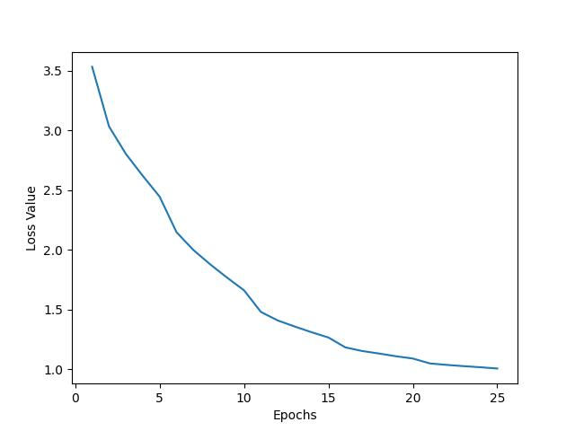
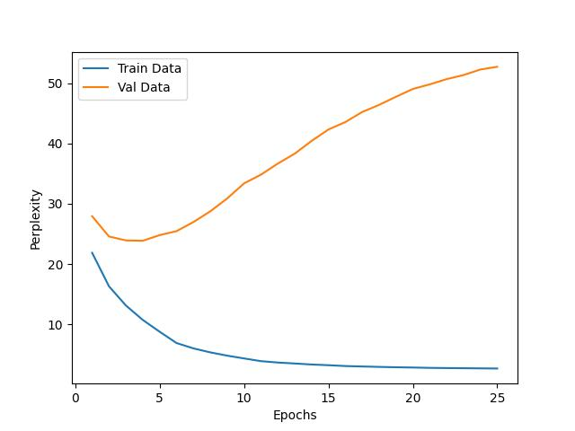

# Nano LM
This project implements a nano-sized, transformer decoder-based, Language Model, which has been trained to generate text autoregressively. This work was done as a learning exercise to understand how GPT and LLMs work and is inspired by [minGPT](https://github.com/karpathy/minGPT).
<br>
The repo contains the following:
- Train word-based and character-based tokenizers from scratch
- Implementation of transformer model in PyTorch from scratch
- Text generation inference using different decoding strategies

# Code
## Dataset
All the experiments and implementation have been performed on the [Wikipedia Movie Plots](https://www.kaggle.com/datasets/jrobischon/wikipedia-movie-plots) dataset. [`dataset.py`](dataset.py) defines the dataloader for the dataset. The dataloader takes a `maxlen` parameter to filter and retain samples that are shorter than this value. Other datasets can be used as well by implementing a similar dataloader.

## Tokenizer
The file [`tokenizer.py`](tokenizer.py) defines a base `Tokenizer` class, over which different kinds of tokenizers can be built, and currently supports character and word-level tokenizers. The tokenizer handles multiple tasks including:
- Cleaning and standardization of text
- Adding special tokens- `<BOS>`, `<EOS>`, `<UNK>` and `<PAD>`
- Creating a vocab from training data
- Encoding text to token ids and decoding token ids back to text

A tokenizer can be trained using the command:
```
python train_tokenizer.py --maxlen <maxlen> --minfreq <minfreq> --savepath <savepath> --tokenizer <tokenizer-type>
```
`<maxlen>` defines the maximum length of the sentence to consider, `<minfreq>` determines which tokens to keep in vocab based on frequency, `<savepath>` is used to store the tokenizer, and `<tokenizer-type>` is used to determine the type of tokenizer to use.

## Model
The model architecture is defined in [`model.py`](model.py). The transformer parameters- embedding dimensions, number of heads, and number of blocks, need to be defined to initialize the model.

## Train
The model can be trained by using the following command:
```
python train.py --n_epochs <epochs> --batch_size <batchsize> --lr <lr> --tokenizer <tokenizer_type> --tokenizer-path <tokenizer_path>  --maxlen <maxlen> --minfreq <minfreq> --dims <dims> --heads <heads> --nblocks <blocks>
```
`<dims>`, `<heads>` and `<blocks>` define the model architecture, while `<epochs>`, `<lr>` and `<batchsize>` define training hyperparameters. Tokenizer can be loaded by passing the appropriate values as defined above and providing a path to the saved tokenizer.

## Inference and Text generation
The trained model can be used for text generation using the following command:
```
python inference.py --tokenizer <tokenizer_type> --tokenizer-path <tokenizer_path>  --maxlen <maxlen> --minfreq <minfreq> --model-path <model_path> --dims <dims> --heads <heads> --nblocks <blocks> --decode-mode <decode_mode>
```
The command requires the tokenizer and model parameters, along with their paths. `<decode_mode>` can be specified to use one of the following decoding strategies- `greedy`, `beam-search` and `sample`. 


# Results
The model was trained and tested on the Wikipedia Movie Plots dataset. A word-based tokenizer was used with maxlen 128 and minfreq 5.
```
python train_tokenizer.py --maxlen 128 --minfreq 5 --tokenizer word --savepath <savepath>
```
This result created a tokenizer with 10681 words as tokens. Using the defined maxlen resulted in a dataset having 8326 train samples and 926 validation samples.

A model with 3 transformer blocks, with 512 dimensions and 8 heads was trained:
```
python train.py --n_epochs 25 --batch_size 32 --tokenizer word --tokenizer-path <tokenizer_path>  --maxlen 128 --minfreq 5 --dims 512 --heads 8 --nblocks 3
```
This created a model with 14M parameters, with each transformer block having 1M parameters.
<br>
The train loss and perplexity curve are shown below: <br>


<br>
Although the training loss looks like moving towards convergence steadily, the perplexity curve suggests that the model starts overfitting. This might be due to small dataset. 

## Generated Text
```
Context: the army general

Greedy: <BOS> the army general jose is sent to live with his estranged wife and a remote village in the village of the local residents more sympathetic dr . a rich man who is a village . the two children is a lazy who live a beautiful village and discovers that the local residents in a new house where the local residents are more than the same situation . <EOS>

Beam Search with 10 beams: <BOS> the army general john travels to the united states during world war ii to work for the affections of world war ii . he falls in love with the daughter of a u . s . ramya falls in love with her . but there he finds out that she was engaged to be treated as well as well as well as well as well as well as well as well . years later he is forced to marry her . when he finds out that he is involved in love with a rich man she kills him . when he returns home he returns to her feelings for his role . when he returns home he realizes he loses his eyesight and marries her to <EOS>

Sample with temperatue 1.0: <BOS> the army general jackson zachary nelson jeff john travels to italy to italy where he marries a respected politician who is waiting for a brighton mental institution . he steals his wife and hugh left alone across the sheriff agar . his men then they fall in love with the francis to continue on the road and end up . <EOS>
```

```
Context: the dog and the dragon

Greedy: <BOS> the dog and the dragon nine characters are touring each other . their lives and the two stories are in their lives . they all around them have a different moral of bird and their own unique set out to find the traditional woman who is in a circle . <EOS>

Beam Search with 10 beams: <BOS> the dog and the dragon fall in love against the area of a group of hong kong mafia boss a drug smuggling ring . the story revolves around the journey of a group of hong kongs triad members of a chinese opera triad members of a chinese martial arts martial arts expert agents led to hong kong police force them to bring them to hong kong police force them to hong kongs triad mafia boss to being held in hong kong police force to investigate in order to destroy hong kongs triad activity in hong kongs triad activity in hong kongs triad activity in hong kong police force lo sa to hong kong police force hong kong to hong kong police force him to hong kong <EOS>

Sample with temperatue 1.0: <BOS> the dog and the dragon lady robs the film is a lady of the police produces about to be hanged where the latter of a worth as her father not general . <EOS>
```


# Future Work
I am pausing this work at this checkpoint, but I would like to visit it sometime to explore the following:
- Efficient inference using quantization
- Attention Visualization
- BPE Tokenization
- Gradio app and hosting on hugginface spaces
- Improving the model performance by using a larger dataset (when I have access to a better GPU)